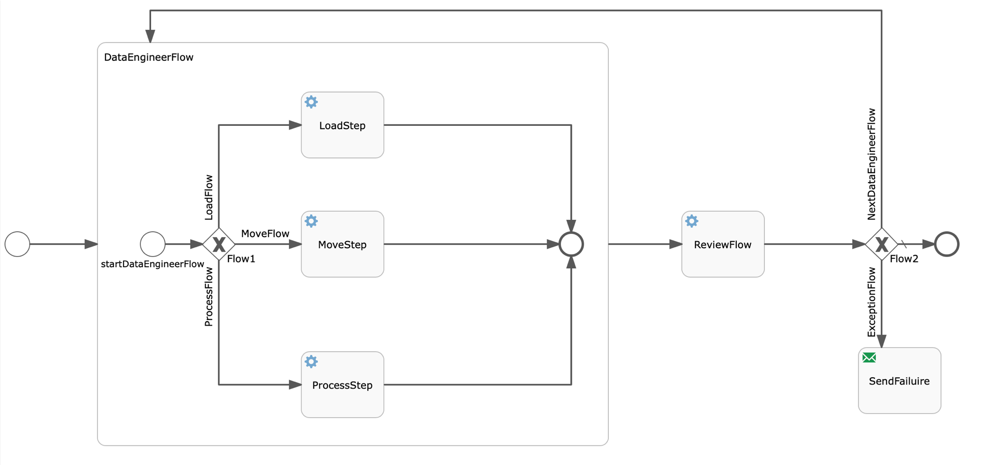

# Spring BOOT Flowable

A Spring Boot application which embeds a BPMN 2.0 inside the application.

Following flow is configured using flowable:

This flow based on the type of execution will execute "loadStep","moveStep" or "processStep" as a loop till there is nothing to execute. In case of failure an email will be send.